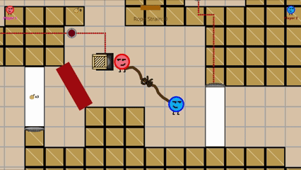
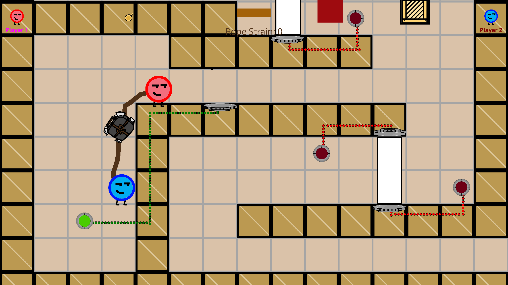

# Homeward Bound
### Windows/Mac
### Target Age: 12+
### Rating: E
## Game Summary: 
Attachment Theory is probably not something you think about particularly often, however, it might explain some things about how your relationships with others have gone, good and bad.  Homeward Bound seeks to give you an intuition about your attachment style and help you better connect with those around you through cooperative gameplay with a partner that changes based on what attachment style you select to play as.  Learn to overcome the challenges of both the attachment styles and the relationship as a whole to find your way home.

## Previews:

## Game Outline: 
After selecting what attachment style to play as (secure, anxious, or avoidant), players will select one of the levels that each explore a different aspect of having a relationship, platonic or romantic.  In the level, the players will work together to keep the strings of their relationship tied together as they overcome puzzles and obstacles that require teamwork.  Themes explored by these levels are dealing with emotional baggage that might get in the way of the relationship, building bridges of trust with your partner, and collecting the keys to have a good relationship.  At times, the players will have a conversation, in which one character will say something to the other and the other player has to choose how to respond.  It is through these dialogues that learning how to respond to your and your partner’s attachment styles occurs.

## Unique Selling Points: 
1. 2-Player co-op puzzle gameplay
2. Gain intuition for attachment styles
3. Unique rope mechanic tying the players together
4. Dialogue choices matter and affect the flow of gameplay
5. Puzzles that play off of the rope and require communication and cooperation
   
## Similar Competitive Products: 
Unraveled 2, Tied Together, Fling to the Finish
